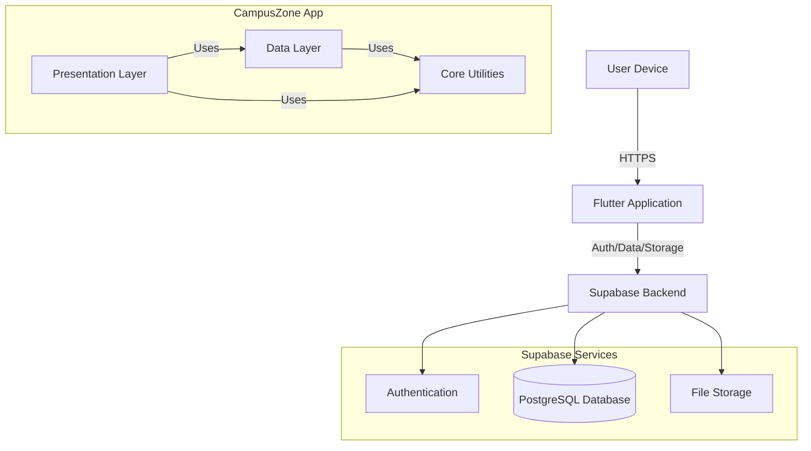

<p align="center">
  
</p>

<h3 align="center">CampusZone</h3>

CampusZone is a comprehensive Flutter mobile application designed to enhance campus life by providing a centralized platform for students to connect, share resources, and stay informed about campus activities.

## Abstract

CampusZone is a mobile application developed using Flutter to provide a centralized platform for students. The application offers various features such as user authentication, profile management, community events, a notice board, a resources section (including notes and lost & found), and a chat system. The primary goal is to facilitate better communication, resource sharing, and engagement among students on campus.

## Problem Statement

In many educational institutions, students face challenges in staying informed about campus activities, connecting with peers, and accessing resources. Traditional methods of communication are often inefficient. There is a need for a modern, centralized platform that can address these issues and improve the overall campus experience.

## Objective

The objective of CampusZone is to create a user-friendly mobile application that addresses the communication and resource-sharing needs of students. The application aims to provide a seamless experience for students to stay informed about campus events, connect with peers, access resources, and engage in meaningful interactions.

## Features

### User Authentication
- Sign up and Login functionality
- Password recovery
- Profile creation

### Profile Management
- View and edit profile details
- Update profile picture with image cropping
- Account settings

### Community Section
- Campus events listing and details
- Event registration via external URLs
- Community announcements

### Notice Board
- Campus-wide announcements and notifications
- Interactive notices with expandable content
- Timestamp and categorization

### Resources Section
- **Notes Repository**: Upload and access PDF notes and study materials.
- **Lost and Found**:
    - Post lost/found items with images.
    - Add descriptions.
    - Comment functionality.

### Chat System
- Direct messaging between users
- Message history
- Real-time updates

## System Architecture




## Project Structure

```
lib/
├── app.dart                    # Main app entry point
├── core/                       # Core functionality
│   ├── config/                 # Environment and configuration
│   ├── constants/              # Assets, colors, strings, themes
│   ├── services/               # External services (Supabase)
│   └── utils/                  # Utility classes and helpers
├── data/                       # Data layer
│   ├── datasources/            # Remote data fetching
│   ├── models/                 # Data transfer objects
│   └── repositories/           # Repository implementations
├── presentation/               # UI Layer
│   ├── layout/                 # Main app shell (scaffold, navbar)
│   ├── screens/                # Application screens
│   │   ├── auth/               # Authentication
│   │   ├── chat/               # Chat
│   │   ├── community/          # Events and community
│   │   ├── home/               # Dashboard and notices
│   │   ├── profile/            # User profile
│   │   └── resources/          # Notes and Lost & Found
│   └── widgets/                # Reusable UI components
├── routing/                    # Navigation and route generation
└── main.dart                   # Application entry
```

## Screenshots

<div style="display: flex; flex-wrap: wrap; gap: 10px;">
  
  
  
  
  
  
  
  
  
  
  
  
</div>

## Setup Instructions

### Prerequisites

- Flutter SDK version 3.6.0 or higher
- Dart SDK
- Android Studio / VS Code with Flutter plugins
- Supabase account

### Installation

1.  **Clone the repository**
    ```bash
    git clone https://github.com/structnull/campuszone.git
    cd campuszone
    ```

2.  **Set up environment variables**
    Create a `.env` file in the root directory with the following variables:
    ```
    SUPABASE_URL=your_supabase_url
    SUPABASE_ANON_KEY=your_supabase_anon_key
    ```

3.  **Install dependencies**
    ```bash
    flutter pub get
    ```

4.  **Generate configuration**
    This project uses `envied` for secure environment variable management. Run the build runner to generate the config files:
    ```bash
    dart run build_runner build
    ```

5.  **Configure Supabase**
    Ensure your Supabase instance has the required tables:
    - `users` (extends `auth.users`)
    - `notices`
    - `events`
    - `chat_messages`
    - `lost_and_found`
    - `notes` (and corresponding storage buckets)

6.  **Run the application**
    ```bash
    flutter run
    ```

## Dependencies

CampusZone relies on several key packages:

-   `supabase_flutter` - Backend and authentication
-   `image_picker` & `image_cropper` - Image handling
-   `google_fonts` - Typography
-   `url_launcher` - Open external links
-   `flutter_staggered_animations` - UI effects
-   `envied` - Environment variable management
-   `pdfrx` - PDF viewing
-   `file_picker` - File selection

For a complete list of dependencies, see the `pubspec.yaml` file.

## Platform Support

-   Android
-   iOS (not tested)

## Contributions

Contributions are welcome. Please follow these steps:

1.  Fork the repository
2.  Create your feature branch (`git checkout -b feature/amazing-feature`)
3.  Commit your changes (`git commit -m 'Add some amazing feature'`)
4.  Push to the branch (`git push origin feature/amazing-feature`)
5.  Open a Pull Request

## Acknowledgements

-   Johan George, Kinnan, Nandu for their ideas and support.
